# Development

This document covers the internal architecture and local development workflow for the Action. If you're just using the action in your own workflows, the [README](./README.md) has everything you need. If you want to contribute, read this first, then jump to [CONTRIBUTING.md](./CONTRIBUTING.md) for the PR process and [RELEASE.md](./RELEASE.md) for the release process.

## How it works

```mermaid
flowchart LR
    WF["Workflow step<br/>(action.yml inputs)"] --> M["main.ts<br/>entrypoint"]
    M --> I["inputs.ts<br/>parse + validate + mask"]
    I --> C["client.ts<br/>B2Client + authorize"]
    C --> D{"dispatch<br/>on inputs.action"}

    D --> U["upload"]
    D --> Dn["download"]
    D --> S["sync"]
    D --> Cp["copy"]
    D --> Dl["delete"]
    D --> P["presign"]
    D --> L["list"]
    D --> H["hide / unhide"]
    D --> V["verify"]
    D --> R["retention"]
    D --> Hd["head"]
    D --> Pg["purge"]

    U & Dn & S & Cp & Dl & P & L & H & V & R & Hd & Pg --> SDK["@backblaze-labs/b2-sdk"]
    SDK --> B2[("Backblaze B2")]

    U & Dn & S & Cp & Dl & P & L & H & V & R & Hd & Pg --> O["outputs +<br/>$GITHUB_STEP_SUMMARY"]

    style M fill:#EE3232,stroke:#fff,color:#fff
    style SDK fill:#EE3232,stroke:#fff,color:#fff
    style B2 fill:#EE3232,stroke:#fff,color:#fff
```



The action is a thin dispatcher. Every verb lands in [`@backblaze-labs/b2-sdk`](https://github.com/backblaze-labs/b2-sdk-typescript); we add input parsing, credential masking (`::add-mask::`), throttled progress logging, and step-summary rendering on top.

## Source layout

```text
src/
  main.ts          # entrypoint: parse inputs, build client, dispatch, set outputs
  inputs.ts        # typed parser + validator for INPUT_* env vars
  client.ts        # B2Client factory + bucket resolver
  sse.ts           # SSE-B2 / SSE-C input parser
  progress.ts      # throttled progress listener
  summary.ts       # $GITHUB_STEP_SUMMARY writer
  version.ts       # VERSION constant (bumped in lockstep with package.json)
  commands/<verb>.ts  # one file per verb (13 today)
__tests__/
  _helpers.ts      # shared makeInputs() builder for command tests
  *.test.ts        # unit tests against the SDK's in-memory B2Simulator
.github/workflows/
  ci.yml                # lint, typecheck, test, coverage, build, dist freshness, smoke
  security.yml          # shared GitHub Actions workflow security checks
  codeql.yml            # CodeQL (SAST) static analysis of the TypeScript source
  release.yml           # see RELEASE.md
  daily-smoke.yml       # 03:13 UTC: real-B2 end-to-end against the test bucket
  large-multipart-smoke.yml  # weekly real-B2 multipart upload integrity check
  example-*.yml         # 12 copy-paste workflows that double as integration tests
action.yml         # Marketplace manifest (inputs, outputs, branding)
dist/index.js      # ncc-bundled entrypoint (committed; CI fails if stale)
```

## Local commands

```bash
pnpm install        # also wires up git hooks (husky): see below
pnpm lint           # biome check --error-on-warnings
pnpm lint:fix
pnpm typecheck      # tsc --noEmit (strict + exactOptionalPropertyTypes)
pnpm test           # vitest run: drives against the SDK's in-memory B2Simulator
pnpm test:coverage  # same + the 95/85/100/95 coverage gate
pnpm test:mutation  # batched per-file Stryker mutation run + aggregate gate
pnpm test:mutation:single  # raw Stryker run for focused local investigation
pnpm build          # ncc build src/main.ts -o dist
pnpm run audit      # pnpm audit --prod --audit-level high (CI gate; needs network)
pnpm spellcheck     # cspell across src/, __tests__/, *.md, *.yml, action.yml
pnpm all            # lint + release policy + typecheck + test + build + spellcheck
pnpm verify-dist    # build, then `git diff --exit-code dist/` (must be clean)
pnpm docs           # typedoc (strict): generates docs/ for GitHub Pages
pnpm docs:watch     # typedoc in watch mode for local authoring
pnpm docs:lint      # markdownlint-cli2 against **/*.md
pnpm docs:links     # runs pinned lychee in offline + fragment-aware mode, excluding node_modules
pnpm docs:check-action-yml  # action.yml <> README sync check
pnpm check:release-provenance  # release.yml provenance isolation policy
```

The full-lockfile audit uses the pnpm builtin directly, not a package script:
`pnpm audit --audit-level high`. This mirrors the per-change and
scheduled/manual workflow that covers dev/build tooling.

Requirements: Node 24+, pnpm 11+. The Action runs on Node 24 in the GitHub Actions runtime; CI tests Node 24 across Ubuntu / macOS / Windows.

### Managed lychee binary

`pnpm docs:links` runs [`scripts/run-lychee.mjs`](./scripts/run-lychee.mjs), a Node built-ins-only wrapper around [lycheeverse/lychee](https://github.com/lycheeverse/lychee). CI intentionally runs this command without `pnpm install`, so the wrapper must stay dependency-free.

Current managed tool:

| Tool | Version | Source | License | Cache |
| --- | --- | --- | --- | --- |
| lychee | `0.23.0` | [`lychee-v0.23.0`](https://github.com/lycheeverse/lychee/releases/tag/lychee-v0.23.0) | Apache-2.0 OR MIT | local: `node_modules/.cache/lychee`; CI: `${{ runner.temp }}/lychee-cache` |

Supported local platforms are `darwin-arm64`, `linux-arm64`, `linux-x64`, and `win32-x64`. Lychee `0.23.0` does not publish an Intel macOS (`darwin-x64`) binary; Intel macOS contributors can rely on the CI `link-check` job for this gate.

Authoritative lychee bump process:

1. Update `LYCHEE_VERSION` in [`scripts/run-lychee-lib.mjs`](./scripts/run-lychee-lib.mjs).
2. Re-check every asset name in `PLATFORM_ASSETS` against the new release. The asset names are part of the pin because lychee has renamed release assets across versions.
3. Download each listed asset from the official GitHub release and refresh the committed `archiveSha256` and `binarySha256` values. For non-archive assets such as `win32-x64`, `archiveSha256` and `binarySha256` are the same raw file hash.
4. Before merge, a second reviewer must independently download the same official release assets, recompute every changed hash, and confirm the PR values. Prefer a separate machine or network for this check when practical. Lychee `0.23.0` does not publish a checksum manifest; if a future release does, verify against it too.

On every cold cache (new version, fresh runner, or cache eviction), `pnpm docs:links` downloads lychee from the official GitHub release endpoint. The docs link gate intentionally fails hard if that endpoint remains unavailable after the wrapper's bounded retries and timeout; this keeps tool acquisition failures visible instead of silently skipping link checks.

Interrupted local installs can leave a cache lock directory behind. The next run waits for the derived install-lock timeout before printing the lock path to remove. That long wait is intentional so a concurrent live install is not deleted; remove the named lock only after confirming no `docs:links` process is running.

## Mutation testing

`pnpm test:mutation` runs
[`scripts/run-batched-mutation.mjs`](./scripts/run-batched-mutation.mjs). The
wrapper runs Stryker once per file listed in the `mutate` array in
[`stryker.conf.json`](./stryker.conf.json), then aggregates the JSON reports and
applies the configured break threshold to the combined score. The per-file
invocation disables Stryker's own break exit so a below-threshold file does not
hide runner, config, or environment failures.

The current mutation scope is the explicit `mutate` list in
`stryker.conf.json`: action-owned `src/*.ts` support modules plus the command
implementations under `src/commands/*.ts` that are named there. Update that
single list when adding or removing mutation targets.

The mutation workflow is scheduled and manually dispatchable only; it is not a
per-PR gate while survivor triage is still being paid down. Reports are written
under `reports/mutation/` locally and uploaded as the `mutation-report`
artifact in CI. The useful files are:

- `reports/mutation/by-file/*.json`: one Stryker JSON report per mutated file.
- `reports/mutation/aggregate.json`: the wrapper's combined score, threshold,
  per-file rows, and status totals.
- `reports/mutation/mutation.json`: Stryker's shared JSON output path from the
  last per-file run.

The workflow audits the full lockfile and rejects blocked lookalike dependency
names before installing the Stryker toolchain.

Stryker core and `@stryker-mutator/vitest-runner` are exact-pinned to the same
version because the runner plugin must stay in lockstep with core; the
Dependabot test-runner group updates them together. `pnpm test:mutation:single`
runs raw `stryker run` using the config reporters, which is useful for focused
local investigation. Do not use a full-scope raw run as the scheduled gate:
with this suite's `vi.resetModules()` + `vi.doMock()` + dynamic import pattern,
the Vitest runner can mis-attribute mutants when all files are instrumented in
one Stryker process. `stryker.conf.json` also sets `vitest.related` to `false`
so every mutant runs the full Vitest suite. That is slower, but it avoids
missing cross-file assertions in the shared command fixtures and dispatcher
tests while the mutation baseline is still being triaged.

Batched-runner baseline for the current mutation scope:

| Scope | Mutation score | Killed | Timed out | Survived | No coverage |
| --- | ---: | ---: | ---: | ---: | ---: |
| All files | 72.83% | 895 | 11 | 333 | 5 |
| `src/commands/*.ts` targets | 62.59% | 332 | 11 | 203 | 2 |
| `src/inputs.ts` | 73.24% | 219 | 0 | 78 | 2 |
| `src/main.ts` | 85.67% | 305 | 0 | 50 | 1 |
| `src/sse.ts` | 95.12% | 39 | 0 | 2 | 0 |

Survivor triage from the baseline:

- The command targets remain the largest survivor bucket. Follow-up assertion
  work should start with upload destination remapping, dry-run paths,
  pagination, and aggregate error handling.
- `src/inputs.ts` still has parser and validation-message survivors. These are
  high-signal action-owned logic and cheap to test.
- `src/main.ts` and `src/sse.ts` now kill most mutants, but the JSON/HTML
  report should still be checked before adding disables because some survivors
  can be equivalent mutants.

The configured aggregate mutation threshold is `break: 65`, with `low: 65` and
`high: 75`. The batched wrapper enforces that threshold only when
`thresholds.break` is a number; setting it to `null` disables the aggregate
failure, matching Stryker's disabled-break semantics. The current 65% break gate
keeps the scheduled workflow passing the 72.83% baseline with 7.83 points of
headroom while still failing on a material regression. Raise the threshold only
after survivors have been triaged and the baseline is re-run. The headroom and
scheduled-only cadence are an intentional bootstrap posture. Once alerting has
proven reliable, either tighten the break threshold toward the baseline, or add
a non-blocking PR information run so sub-threshold drift is visible before the
weekly cron.

Default-branch scheduled and manual failures open or update one
`mutation-testing-failure` tracking issue through
`.github/actions/tracking-issue`; a later passing run closes it. This mirrors
the full-lockfile audit workflow so red cron runs are visible without polling
the Actions tab.

## Git hooks

`pnpm install` runs `husky` (via the `prepare` script) which installs the hooks under [`.husky/`](./.husky/). Two hooks are active:

| Hook | What it runs | Triggers on |
| --- | --- | --- |
| `pre-commit` | `pnpm lint` + release-provenance policy check + `pnpm typecheck` + `pnpm test` + `pnpm build` + `dist/` freshness check + `pnpm spellcheck`. Every local code/doc check, every commit, no path-gating. | Every `git commit` |
| `pre-push` | `pnpm test:coverage` (subsumes plain `test`, so we don't double-run). | Every `git push` |

Pre-commit runs every repo-local code/doc check so a small change cannot skip an important local gate. On a clean repo this takes ~5 s. Skip either hook with `--no-verify` if you need to; the same checks run in CI.

GitHub Actions workflow security is centralized in [`.github/workflows/security.yml`](./.github/workflows/security.yml), which calls the shared `backblaze-labs/github-actions` composite action pinned to a commit SHA. The shared action owns actionlint, third-party action pin checks, and zizmor audits so this repo does not carry local copies of those scripts. With a sibling checkout of `../github-actions`, maintainers can still use the same shared tooling locally:

```bash
node ../github-actions/scripts/format-workflows.mjs --root . --write
node ../github-actions/scripts/check-action-pins.mjs --root . --fix
node ../github-actions/scripts/check-action-pins.mjs --root .
env ACTIONLINT_CACHE_DIR=/private/tmp/backblaze-actionlint bash ../github-actions/scripts/actionlint.sh
```

## Conventions

This repo mirrors the [`b2-sdk-typescript`](https://github.com/backblaze-labs/b2-sdk-typescript) style:

- Biome formatter / linter (2-space indent, single quotes, no semicolons, 100-char width). Run `pnpm lint:fix` before pushing.
- `exactOptionalPropertyTypes` is ON. Use conditional-spread (`...(v !== undefined ? { k: v } : {})`) rather than passing `undefined`.
- `verbatimModuleSyntax` is ON. Use `import type` for type-only imports.
- Internal relative imports use `.ts` extensions (`import { x } from './foo.ts'`), not `.js`.
- All source under `src/`. Tests under `__tests__/` so they don't ship in `dist/`.

## CI gates

Pull requests run the core gates below. Scheduled and manual-only checks are
listed in the same table and called out explicitly.

| Job | What it checks |
| --- | --- |
| `test` (matrix: ubuntu/macos/windows) | typecheck + vitest unit suite |
| `lint` | biome `--error-on-warnings` |
| `coverage` | vitest with v8 coverage, threshold 95 % statements / 85 % branches / 100 % functions / 95 % lines |
| `mutation-testing` ([mutation-testing.yml](./.github/workflows/mutation-testing.yml)) | Batched per-file Stryker mutation testing against the configured `stryker.conf.json` mutation scope. Runs weekly and manually; it uploads the JSON report artifact, opens or updates a tracking issue on default-branch failure, and fails if the aggregate mutation score drops below the configured break threshold (65%). |
| `build-and-check-dist` | ncc build, then `git diff --exit-code dist/`. **Drift fails CI**: rebuild with `pnpm build` and commit `dist/`. Bundle size is gated hard at 4 MiB. |
| `release-provenance-policy` ([security.yml](./.github/workflows/security.yml)) | parses release workflow YAML and enforces OIDC/attestation isolation, validated-SHA checkouts, tag re-verification, staged release asset upload, and post-upload verification. |
| `github-actions` ([security.yml](./.github/workflows/security.yml)) | runs the shared GitHub Actions security composite action against every workflow, including actionlint, third-party action pin checks, and zizmor audits (see [Pinning third-party actions](#pinning-third-party-actions)) |
| `self-smoke` | runs `node dist/index.js` with no inputs, expects the missing-input error |
| `analyze` ([codeql.yml](./.github/workflows/codeql.yml)) | CodeQL (SAST) over the TypeScript source (`build-mode: none`, no compile needed). Runs on PRs to `main`, push to `main`, and weekly; findings surface in the repo Security tab. |
| `audit` | `pnpm audit --prod --audit-level high`: fails on a high/critical advisory in a **production** dependency. Scoped to prod (not devDeps) so a dev-tool advisory can't block an unrelated PR; devDep updates are handled by Dependabot. CI calls the builtin `pnpm audit` directly (resolves against the lockfile, no install); `pnpm run audit` is the local-convenience equivalent. |
| `full-lockfile-audit` ([full-lockfile-audit.yml](./.github/workflows/full-lockfile-audit.yml)) | `pnpm audit --audit-level high` across the full lockfile, including dev/build tooling used to produce committed `dist/`. Runs on PRs and pushes that touch dependency/audit policy files, plus weekly and manually. PR findings are informational (`continue-on-error`) so unrelated feature work is not blocked; push/scheduled/manual default-branch failures open or update one labeled tracking issue, with infrastructure failures separated from dependency advisories. A later passing default-branch run closes open tracking issues. |
| `heartbeat` ([full-lockfile-audit-heartbeat.yml](./.github/workflows/full-lockfile-audit-heartbeat.yml)) | Daily check that a scheduled, manual, or main-push full-lockfile audit has fired in the last 10 days; opens or updates one labeled tracking issue when a transient cron drop leaves the audit stale, and closes it once the audit recovers. It stays silent before the first audit run has ever been observed. Because it is also scheduled, this heartbeat does not protect against GitHub's 60-day inactivity auto-disable or a broader GitHub Actions scheduling outage; after long repository inactivity, maintainers should verify scheduled workflows in the Actions UI or manually dispatch `full-lockfile-audit.yml` on `main`. |
| `sync-check` ([docs-lint.yml](./.github/workflows/docs-lint.yml)) | every input/output in `action.yml` also appears in the README reference tables. Drift fails CI. |
| `markdownlint` ([docs-lint.yml](./.github/workflows/docs-lint.yml)) | prose-style consistency across `**/*.md`. Config in [`.markdownlint-cli2.jsonc`](./.markdownlint-cli2.jsonc). |
| `link-check` ([docs-lint.yml](./.github/workflows/docs-lint.yml)) | `pnpm docs:links` runs pinned lychee in `--offline` mode against `**/*.md`; catches broken relative paths and anchor fragments. External URLs are not pinged. |
| `spellcheck` ([docs-lint.yml](./.github/workflows/docs-lint.yml)) | cspell across `**/*.ts`, `**/*.md`, `**/*.yml`, `action.yml`. Config in [`cspell.json`](./cspell.json); domain-specific words live in [`.cspell/project-words.txt`](./.cspell/project-words.txt). Add a word there when cspell flags a deliberate identifier. |
| `docs` ([docs.yml](./.github/workflows/docs.yml)) | TypeDoc with `treatWarningsAsErrors: true`; every export must have JSDoc. Published to GitHub Pages on push to `main`. |

Plus, the [example workflows](./.github/workflows/README.md) are the integration test suite: they run against a real B2 test bucket on every PR (skipping forks because secrets aren't available there). The bucket itself is set up as described in the next section.

### Pinning third-party actions

Every third-party action under `.github/workflows/` is pinned to a full commit SHA with a trailing exact-version comment (for example `uses: actions/checkout@<sha> # v6.0.2`), so a moved or compromised upstream tag cannot run in our CI or the `contents: write` release job. The comment names the precise release the SHA represents, so a reviewer can confirm it at a glance. Dependabot's `github-actions` updates bump the SHA and the comment together. When you add a workflow step, pin it the same way: resolve the tag with `gh api repos/<owner>/<repo>/commits/<tag> -q .sha` and add the `# vX.Y.Z` comment. The repo's own action is referenced as `uses: ./` and is not pinned. This is enforced automatically by [`.github/workflows/security.yml`](./.github/workflows/security.yml), which uses the shared `backblaze-labs/github-actions` composite action; an accidental regression to `@v1` (or a major-only comment) cannot merge.

## Test bucket setup

The example workflows, `daily-smoke.yml`, and `large-multipart-smoke.yml` all hit a real B2 bucket. The upstream project uses:

| Purpose | Bucket name | Required? |
| --- | --- | --- |
| Main destination for almost every example | `backblaze-labs-b2-action-ci-tests` | yes |
| Source bucket for `example-cross-bucket-replicate.yml` | `backblaze-labs-b2-action-ci-tests-src` | optional |
| Object-Lock-enabled bucket for `example-scheduled-backup.yml` (retention test) | `backblaze-labs-b2-action-ci-tests-lock` | optional |

If you're forking and want to run the integration suite against your own B2 account, the bucket names don't matter: only the secret values do. The workflows resolve everything through `${{ secrets.B2_TEST_BUCKET }}` etc.

### B2-side configuration

Apply this to each bucket (the satellite ones get the same treatment as the main):

- **Type:** `allPrivate`. The workflows authenticate via the application key; public access isn't needed.
- **Lifecycle rule:** auto-hide and auto-delete after 1 day. Every workflow cleans up its own `<run-id>/` prefix in `if: always()` steps, but the lifecycle rule is belt-and-suspenders for the case where an aborted run leaves objects behind.
- **Object Lock:** **enabled only on `…-tests-lock`**. The `retention` verb requires `fileLockEnabled: true` at bucket creation time, which cannot be added later. Leave it off on the other two.

### Application key scope

Create one application key with these capabilities, scoped to the three buckets (or to "all buckets" if you prefer the simpler scope and accept the broader blast radius):

- `listBuckets`, `listFiles`, `readFiles`, `writeFiles`, `deleteFiles`: needed by `upload`, `download`, `sync`, `list`, `delete`, `copy`, `hide`, `unhide`, `purge`.
- `readFileRetentions`, `writeFileRetentions`, `readFileLegalHolds`, `writeFileLegalHolds`: needed by the `retention` example.
- `bypassGovernance`: only if you want the test that exercises shortening a governance retention.
- `shareFiles`: needed by `presign`.

### GitHub repo secrets

In `Settings → Secrets and variables → Actions`, set:

| Secret | Value |
| --- | --- |
| `B2_APPLICATION_KEY_ID` | The application key ID from the previous step. |
| `B2_APPLICATION_KEY` | The application key (this is shown once at creation: store it). |
| `B2_TEST_BUCKET` | `backblaze-labs-b2-action-ci-tests` (or your equivalent). |
| `B2_TEST_BUCKET_SRC` | `backblaze-labs-b2-action-ci-tests-src` (optional; unlocks `cross-bucket-replicate`). |
| `B2_TEST_BUCKET_LOCKED` | `backblaze-labs-b2-action-ci-tests-lock` (optional; unlocks `scheduled-backup`). |
| `B2_SSE_C_KEY_B64` | Optional base64-encoded 32-byte SSE-C key. If unset, the `sse-encryption` example generates a per-run key as fallback. |

Once those are in place, the example workflows trigger on every PR (other than forks, which can't see secrets), the `daily-smoke.yml` cron runs nightly, and `large-multipart-smoke.yml` runs weekly. There's no manual step beyond setting the secrets.

### Simulator vs real bucket: what each layer catches

- **Vitest + `B2Simulator`** (`pnpm test`): instant, deterministic, runs on every PR including forks. Validates the dispatcher, input parsing, error paths, and the SDK contract. Doesn't touch the network.
- **Example workflows** (`.github/workflows/example-*.yml`): real wire-protocol. Catches B2 API drift, auth quirks, and integration-layer regressions that the simulator can't see. Skips on forks (secrets-gated).

The redundancy is deliberate: the simulator suite is what guarantees a contributor's fork PR gets validated end-to-end before secrets-gated workflows run.

## Coverage

Coverage is at **100 % statements / 100 % branches / 100 % functions / 100 % lines** across 156 tests. Zero `v8 ignore` annotations in `src/`. Every uncovered branch the SDK formerly exposed (multipart `contentSha1: null`, pagination handover, `delete-remote` on unversioned buckets, `error` events from `deleteAll`, `bucket.head()` shape, `pageSize` rename, `SyncEvent` narrowing) shipped in the SDK and the action's tests drive them against real simulator behavior. If you add a new code path, add a real test for it; do not introduce a `v8 ignore` without a documented external reason.

## Step-by-step: adding a new verb

The pattern is the same every time:

1. **Implement** in `src/commands/<verb>.ts` exporting an async `xxxCommand(bucket, inputs)` (or `(client, bucket, inputs)` if you need the `B2Client` directly, like `presign` and `copy`).
2. **Register** the verb in `src/inputs.ts`: add to the `ActionName` type and `VALID_ACTIONS` array.
3. **Dispatch** in `src/main.ts`: switch case that maps the typed result to `core.setOutput(...)` and `writeStepSummary({...})`.
4. **Document** in `action.yml`: any new inputs and outputs the verb introduces.
5. **Test** under `__tests__/commands/<verb>.test.ts`: use `makeInputs(action, override)` from `_helpers.ts` and the SDK's `B2Simulator`. Cover happy path + at least one error.
6. **Example workflow** at `.github/workflows/example-<verb>.yml`: copy-paste-runnable AND acts as a live integration test against the project's test bucket.
7. **README + CHANGELOG**: add a row to the verb table, a usage snippet, and an `[Unreleased]` CHANGELOG entry.
8. **Rebuild** `dist/index.js` with `pnpm build` and commit it.

The deeper "how to contribute" workflow lives in [CONTRIBUTING.md](./CONTRIBUTING.md); the release runbook is in [RELEASE.md](./RELEASE.md).

## Why ncc, not Vite

The sibling SDK uses Vite library mode because it ships to npm with subpath exports. A GitHub Action is the opposite shape: one CJS-bundled `dist/index.js` that GitHub executes directly. `@vercel/ncc` is the standard `actions/typescript-action` tool for this: it produces a single bundle, sourcemaps, tree-shakes deps, and handles the dynamic `await import('node:fs/promises')` calls the SDK's sync engine uses for lazy `node:fs` loading in browser-isomorphic code.

## Why `dist/` is committed

GitHub Actions runs the action's `main:` entrypoint directly from the repo: there's no `npm install` step at usage time. So `dist/index.js` must be checked in. CI's `build-and-check-dist` job rebuilds and `git diff --exit-code dist/` to guarantee the committed bundle matches `src/`. Always run `pnpm build` before opening a PR that changes anything under `src/`.

## Bundle-size budget

`dist/index.js` is gated at **4 MiB** in CI. The SDK has zero runtime deps, so the current bundle sits comfortably under 1.5 MiB; the budget exists to force a deliberate decision (in the PR) before any dependency that would push it over.

## User-Agent contract

The SDK builds a User-Agent of the form:

```text
b2-sdk-typescript/<sdk-version> (typescript; @backblaze-labs/b2-sdk; <runtime>; <os>; <arch>) b2-github-action/<action-version>
```

We append the `b2-github-action/<v>` suffix so Backblaze's server-side logs can identify CI traffic originating from this Action. **Do not rename either the SDK's `b2-sdk-typescript/` token or our `b2-github-action/` token**: both are stable product identifiers used for traffic analytics. The version constant is in [`src/version.ts`](./src/version.ts) and must be bumped in lockstep with `package.json` `version`.
